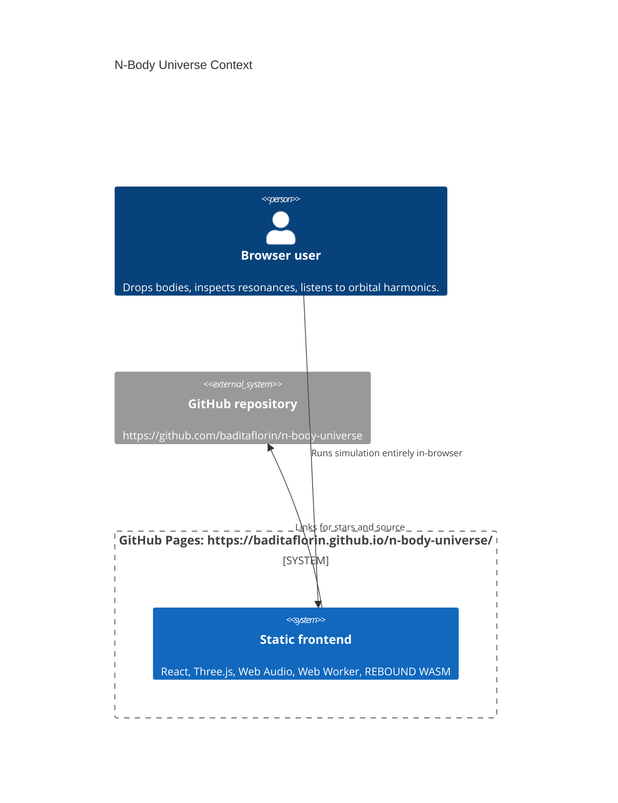
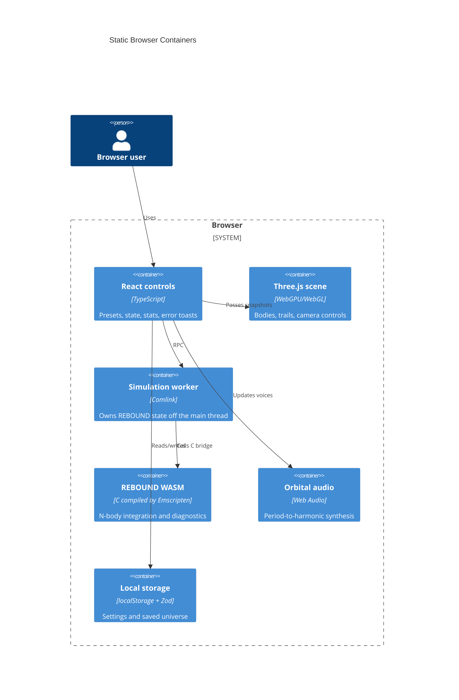

# Architecture

N-Body Universe is a Mode A GitHub Pages application. The public runtime surface is static assets only:

```mermaid
C4Context
  title N-Body Universe Context
  Person(user, "Browser user", "Drops bodies, inspects resonances, listens to orbital harmonics.")
  System_Boundary(pages, "GitHub Pages: https://baditaflorin.github.io/n-body-universe/") {
    System(app, "Static frontend", "React, Three.js, Web Audio, Web Worker, REBOUND WASM")
  }
  System_Ext(repo, "GitHub repository", "https://github.com/baditaflorin/n-body-universe")
  Rel(user, app, "Runs simulation entirely in-browser")
  Rel(app, repo, "Links for stars and source")
```

```mermaid
C4Container
  title Static Browser Containers
  Person(user, "Browser user")
  System_Boundary(browser, "Browser") {
    Container(ui, "React controls", "TypeScript", "Presets, state, stats, error toasts")
    Container(scene, "Three.js scene", "WebGPU/WebGL", "Bodies, trails, camera controls")
    Container(worker, "Simulation worker", "Comlink", "Owns REBOUND state off the main thread")
    Container(wasm, "REBOUND WASM", "C compiled by Emscripten", "N-body integration and diagnostics")
    Container(audio, "Orbital audio", "Web Audio", "Period-to-harmonic synthesis")
    Container(storage, "Local storage", "localStorage + Zod", "Settings and saved universe")
  }
  Rel(user, ui, "Uses")
  Rel(ui, worker, "RPC")
  Rel(worker, wasm, "Calls C bridge")
  Rel(ui, scene, "Passes snapshots")
  Rel(ui, audio, "Updates voices")
  Rel(ui, storage, "Reads/writes")
```

There is no backend API, no database, and no server-side secret.
